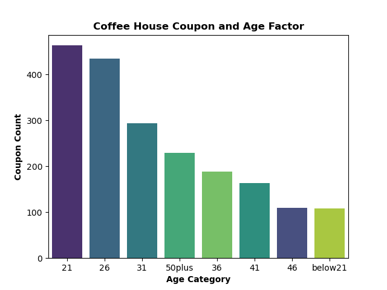
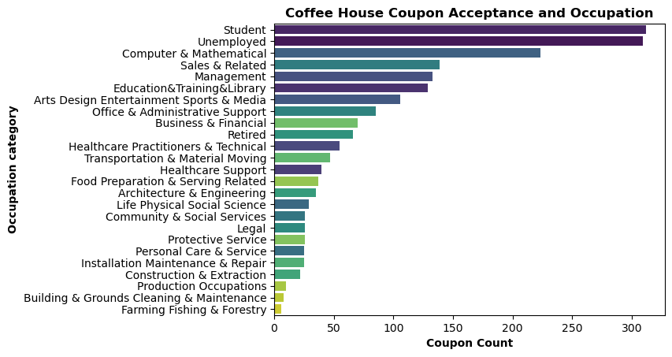
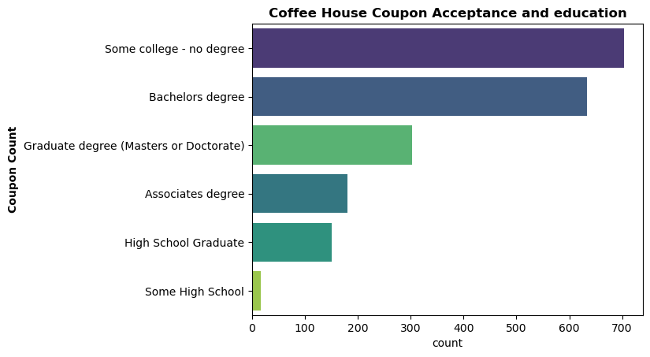

# Berkely Professional Certificate in ML/AI   Practical Application-1(Module-5/Assignment 5.1) :  Will the Customer Accept the Coupon?

The goal of this project is to use Probability Distributions and Visualizations and distinguish between customers who accepted a driving coupon versus those who did not. The project also involves applying data analysis, plotting, statistical summarization, and data visualization skills and techniques to a machine learning problem.

# Note about the Files, Folder and Dataset...
1> The Folder Structure for this Project is as below under the repository: "BerkeleyMLAI-Module5-Practical-Exercises"

2> The Dataset used for analysis is provided here:[Link to Coupons Dataset](data/coupons.csv) (Dataset is comprised of 12684 records and 26 Column Headers) 
3> The coding language used is Python. The libraries used are: pandas, seaborn, matplotlib and numpy 
4> Jupyter Notebook is included in the     "Code" Folder: [Link to Jupyter Notebook](code/CustomerCouponAcceptance.jpynb)

## Exploratory Data Analysis and Dataset Investigation:
Snap Shot of the actuals : Columns or the Attributes in the Dataset -

#### Missing Data:
This is the sbnapshot of the missing data - 

 
As seen from above the car' column had higher percentage of missing data. And was not taken into consideration. For the rest of the Data column elements the most occuring data value appearing in the respective column was filled in.
 
#### Duplicate Data: 
74 Duplicate Records were also removed.
The final count of Dataset arrived at for analysis was : 12610

## General Data Visualizations
Plot of Popularity of the Coupon itself. 

 
 
What weather do people prefer when going out with coupons? 

 
## Data Summary Points
#### General:
Proportion of Total Observations who decided to accept the coupon were :  7157 which is 56.76% 
#### Bar Coupon Acceptance Readout:
* Acceptance rate for Bar coupons was found to be : **40.9%**
* Acceptance rate from those who go to bar <=3 times a month : **37.05%**
* Acceptance rate from those who go to the bar >3 times a month : **76.88%**
* Drivers Over 25 who go to bar, their acceptance rate : **69.52%**
* Acceptance rate of drivers that go to the bar at least once per month and have no kids : **71.32%**
* Acceptance rates of those who go to bars more than once a month, had passengers that were not a kid, and were not widowed : **71.32%**
* Acceptance rates of those who go to bars more than once a month and are under the age of 30 : **72.17%**
* Acceptance rates of those who go to cheap restaurants more than 4 times a month and income is less than 50K : **45.34%**
## Hypotheses
We can hypothesize the following about drivers who accepted the bar coupons:

* **Age Factor**                  : 72% of the young adults who are less than 30yrs frequent the bar often more than once a month, and they also willingly 
                                    accept coupons
* **Prefer Cheaper Places**       : People who make less income seems to prefer cheaper dining places
* **Atleast 1 Bar visit a month** : Is primarily among those who don't have any kids - Kind of social animals
* **Bar visits to Frequency**     : There is one more trait and thats to do with frequency of bar visits and the acceptance rate of coupons
* **Occupation and Acceptance**   : People who do NOT fish, farm or are involved in forestery seem to lean towards accepting coupons 56.0%
* **Drivers Over 25 and
    compared to rest others**     : Not much of acceptance (33%)
 

## Independent Investigation - Coffee House Coupon Acceptors 

This provides analysis information and plots of customers who accepted Coffee House Coupons
 
 

**Coffee House Coupons and Age Factor:** Looks like the category of people who accept coffee house coupons are more in the 20's. 
 
 

**Coffee House Coupons Acceptance and Occupation Factor:** Interestingly people with no or some college education possibly seem to socialize a lot than the one with a bit of higher education, student community are also more on the acceptance side of the graph.
 
 

**Coffee House Coupons Acceptance and Marital Factor:** Divorced and those with single status look not to be socializing much or going out.
 
 

**Coffee House Coupons Acceptance and Edcuation Factor:** More of the professional working group members seems to not accept coffee house coupons. Possible they prefer some other form of coupons.
 
 
## Possible Next Steps:
 
1> Simplification of Data for easier analysis. 
2> Some other data factors have not been used in the above analysis, like Destination, Location, Direction,  Time of day, Weather conditions to study how it may affect the   acceptance rate of the coupons. 
3> Look for some other dependent datasets which may influence this dataset. 
4> Are there any other external factors and models which needs to be accounted for?
