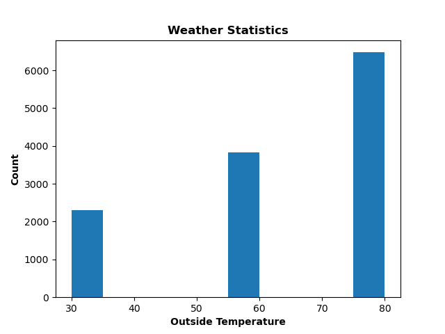

# Practical Application-1 Berkely Professional Certificate in ML/AI (Module-5 Assignment 5.1) - Will the Customer Accept the Coupon?

The goal of this project is to use Probability Distributions and Visualizations and distinguish between customers who accepted a driving coupon versus those who did not. The project also involves applying data analysis, plotting, statistical summarization, and data visualization skills and techniques to a machine learning problem.

# Note about the Folder and Files and Dataset
1> The Folder Structure for this Project is as below under the repository: "BerkeleyMLAI-Module5-Practical-Exercises"

2> The Dataset used for analysis is provided here:[Link to Coupons Dataset](data/coupons.csv) (Dataset is comprised of 12684 records and 26 Column Headers) 
3> The coding language used is Python. The libraries used are: pandas, seaborn, matplotlib and numpy
4> Jupyter Notebook is included in the "Code" Folder: [Link to Jupyter Notebook](code/CustomerCouponAcceptance.jpynb)

## Exploratory Data Analysis and Dataset Investigation:
Snap Shot of the actuals : Columns or the Attributes in the Dataset -

#### Missing Data:
This is the sbnapshot of the missing data -

 
As seen from above the car' column had higher percentage of missing data. And was not taken into consideration. For the rest of the Data column elements the most occuring data value appearing in the respective column was filled in.
 
#### Duplicate Data: 
74 Duplicate Records were also removed.
The final count of Dataset arrived at for analysis was : 12610

## General Data Visualizations
Plot of Popularity of the Coupon itself.

 
 
Plot of when  do people prefer to go out and use the coupons.

 
## Data Summary Points
#### General:
Proportion of Total Observations who decided to accept the coupon were :  7157 56.76% 
#### Bar Coupon Acceptance Readout:
* Acceptance rate is: **40.9%**
* Acceptance rate from those who go to bar <=3 times a month: **37.05%**
* Acceptance rate from those who go to the bar >3 times a month: **76.88%**
* Drivers Over 25 who go to bar, their acceptance rate: **69.52%**
* Acceptance rate of drivers that go to the bar at least once per month and have no kids: **71.32%**
* Acceptance rates of those who go to bars more than once a month, had passengers that were not a kid, and were not widowed: **71.32%**
* Acceptance rates of those who go to bars more than once a month and are under the age of 30: **72.17%**
* Acceptance rates of those who go to cheap restaurants more than 4 times a month and income is less than 50K: **45.34%**
## Hypotheses
We can hypothesize the following about drivers who accepted the bar coupons:

* **1> Age Factor**               : 72% of the young adults who are less than 30yrs frequent the bar often more than once a month, and they also willingly 
                                    accept coupons
* **Prefer Cheaper Places**       : People who make less income seems to prefer cheaper dining places
* **Atleast 1 Bar visit a month** : Is primarily among those who don't have any kids - Kind of social animals
* **Bar visits to Frequency**     : There is one more trait and thats to do with frequency of bar visits and the acceptance rate of coupons
* **Occupation and Acceptance**   : People who do NOT fish, farm or are involved in forestery seem to lean towards accepting coupons 56.0%
* **Drivers Over 25 and
    compared to rest others**     : Not much of acceptance (33%)
 

## Independent Investigation - Carry Out & Take Away Coupon Declines

Further analysis focused on drivers who declined Carry Out & Take Away coupons.
 
 

**Age:** The age groups of 21 and 26 years old are the most likely to decline Carry Out & Take away coupons, each constituting approximately 20% of the declines. This suggests that younger adults in their early to mid-twenties are more inclined to decline these coupons.
 
 

**Marital Status:** The majority of declines come from individuals with a married partner (approximately 40%) and singles (approximately 37%). This indicates that marital status, particularly being married or single, plays a significant role in the likelihood of declining Carry Out & Take away coupons.
 
 

**Education:** Individuals with a Bachelor's degree are the most likely to decline these coupons, making up approximately 37% of the declines, followed by those with some college but no degree (approximately 30%). This suggests a higher tendency to decline among those with higher education levels.
 
 
## Recommended Next Steps

Based on the analyses performed and the insights gained about drivers who accept bar coupons and those who decline Carry Out & Take Away coupons, here are the recommended next steps to further understand the dataset and actions to take as a result of this increased understanding:

* **Segmentation Analysis:** Perform a deeper segmentation analysis to identify more nuanced segments within the dataset. This could involve looking at combinations of factors such as time of day, weather conditions, and location to understand how these variables influence coupon acceptance rates.

* **Predictive Modeling:** Develop predictive models to forecast coupon acceptance rates based on driver demographics, behaviors, and external factors.

*  **A/B Testing:** Conduct A/B testing with different coupon designs, offers, and messaging to see which variations lead to higher acceptance rates among different driver segments. This can help refine marketing strategies and improve coupon effectiveness.

*  **Economic Impact Analysis:** Assess the economic impact of coupon campaigns on business outcomes such as increased sales, customer retention, and brand loyalty. This analysis could help justify the investment in coupon campaigns and guide budget allocation.

*  **Competitive Analysis:** Conduct a competitive analysis to understand how competitors are using coupons and promotions. This can help identify best practices and opportunities for differentiation.

*  **Integration with Other Marketing Channels:** Explore the integration of coupon campaigns with other marketing channels such as social media, email marketing, and in-app notifications. A multi-channel approach could enhance the reach and effectiveness of coupon promotions.
